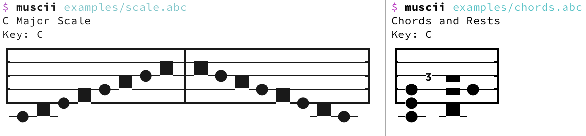

# Muscii

Render sheet music as ASCII art in your terminal.




## Usage

Muscii reads [ABC notation](https://abcnotation.com/) and renders it as an
staff using Unicode characters.
Pass a file, or pipe ABC in on stdin:

```sh
muscii examples/scale.abc
# or
cat examples/scale.abc | muscii
```

Check out the [examples](examples/) directory for more sample ABC files to try.

Built on the [`abc-parser`](https://crates.io/crates/abc-parser) crate.


## Ideas

### Pure ASCII Mode

```txt
                              ____
     _                       |____|
 ___( )__|_____|\____________|____|_______||
|___|/___|_____|_______|\__(0)__(0)_______||
|__/|____|___(0)_______|\_________________||
|_( | )__|___________(0)__________________||
|___|____|__________________________(_)___||
    |                                 |
                                      |
```


### Make Use of Additional Symbols

Name | Sign
-----|------
Ideographic Number Zero | `───〇───`
Large Circle | `───◯───`
Black Large Circle | `───⬤───`
Bold White Circle | `───🞆───`
Bullseye | `───◎───`
Circled Digit One | `───①─②─Ⓐ─⓫─⓵───`
Circled Crossing Lanes | `───⛒───`
Circled White Star | `───✪───`
Circle with Horizontal Bar | `───⦵───`
Circled Open Centre Eight Pointed Star | `───❂───`
Combining Enclosing Circle Backslash | `───⃠───`
N-Ary Circled Dot Operator | `───⨀───`
N-Ary Circled Times Operator | `───⨂───`
N-Ary Circled Plus Operator | `───⨁───`
Large Red Circle | `───🔴───`
Heavy Large Circle | `───⭕───`
Heavy Circle with Circle Inside | `───⭗───`
Heavy Circled Saltire | `───⭙───`
Combining Enclosing Circle | `── ⃝ ───`
Sun | `───☉───`
New Moon with Face | `───🌚───`
New Moon Symbol | `───🌑───`
Globe with Meridians | `───🌐───`
Full Moon Symbol | `───🌕───`
Sun with Face | `───🌞───`
Earth Globe Europe-Africa | `───🌍───`
